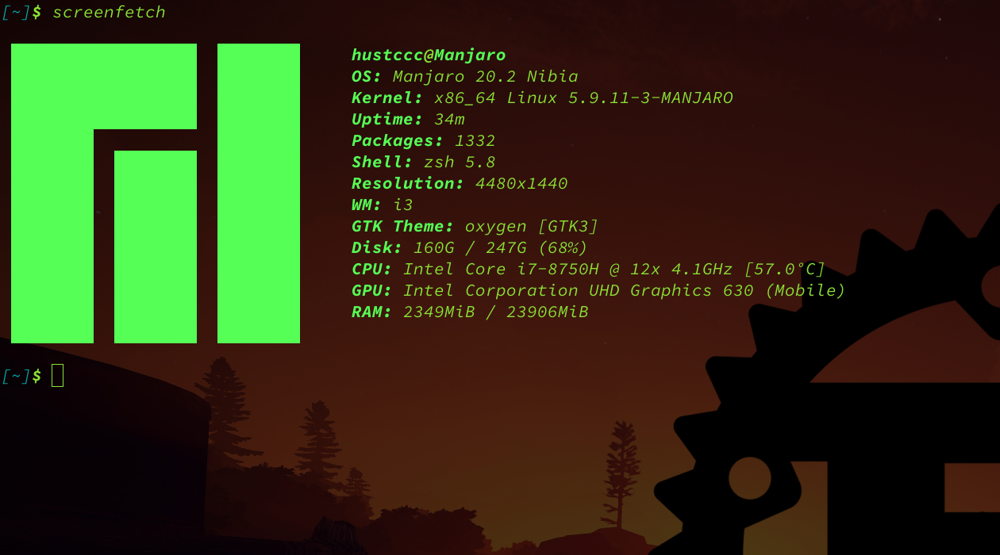
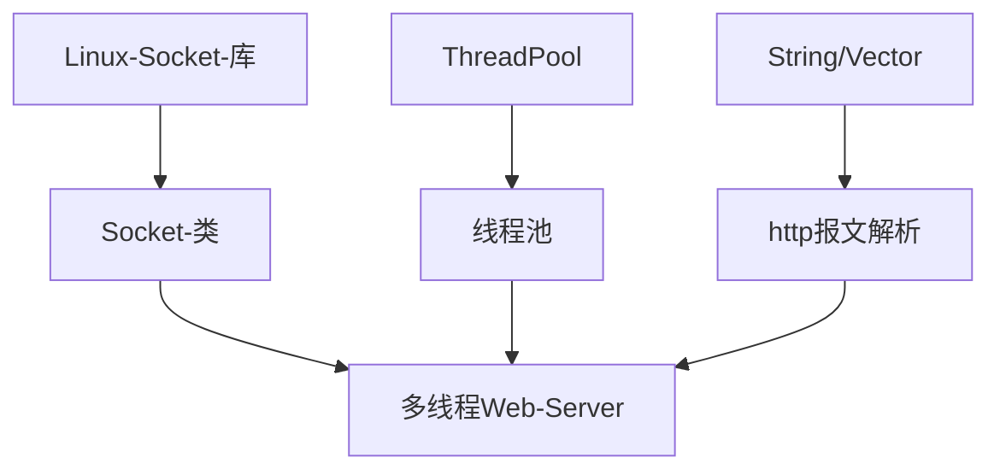
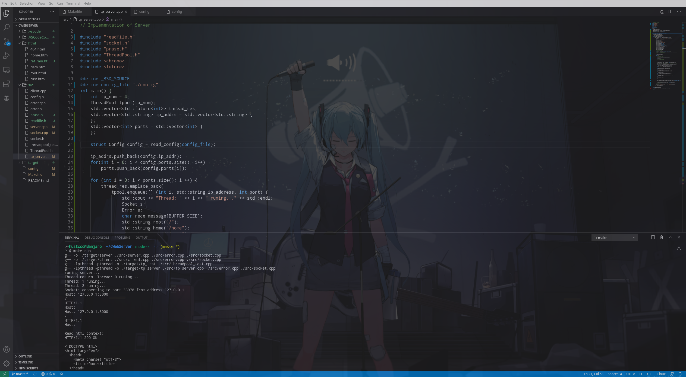
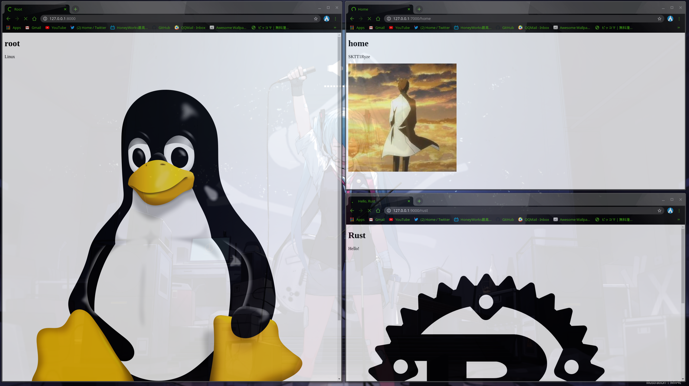

# <center>华中科技大学计算机科学与技术学院</center>  <center>计算机网络实验报告</center>  <center>Socket 编程实验</center>  
<center>计科校交 1801</center>  <center>车春池</center>  <center>U201816030</center>  

## TOC

* [环境](#0)  
* [系统功能要求](#1)   
* [系统设计](#2)   
* [系统实现](#3)  
* [系统测试及结果说明](#4)  
* [参考文献](#5)  

<span id="0"></span>
## 环境
### 操作系统
Linux 发行版 Manjaro 系统  
  

### 项目环境配置
整个项目基于 Linux Socket 库搭建，使用 GCC 进行编译链接，使用 make 和 Makefile 对整个项目进行管理。项目中代码，目标文件，资源文件还有文档分开放在不同的文件夹中，做到文件分类管理。  
在终端里进入到项目目录下，运行 make tp_server 即可运行一个多线程的 WebServer，这同时也是实验要求的程序实现。另外还可以运行 make server 来运行一个单线程的 WebServer，可以响应其他的 client 的请求。最后还可以运行 make clean 来删除生成的目标文件和中间文件。  

<span id="1"></span>
## 系统功能要求
实现一个 Web 服务器软件，要求如下：  
+ 可配置 Web 服务器的监听地址，监听端口和主目录
+ 能够单线程处理一个请求，当一个 client 连接时创建一个连接套接字
+ 从连接套接字接受 http 报文，创建一个由请求的文件组成的 http 响应报文
+ 经 tcp 连接向请求的浏览器发送响应，浏览器可以正确显示网页的内容
+ 服务可以启动和关闭
+ 实验必须基于 Socket 编程，不能直接借用任何现成的组件

<span id="2"></span>
## 系统设计
### 代码层次结构
本项目基于 Linux Socket 库实现了一个多线程的 Web 服务器，主要通过 C++ 类对 Socket 套接字相关逻辑进行封装以对程序中多次创建的 Socket 套接字进行统一的管理和调度，并在 main 函数里面调用这个 Socket 类和另外一些子模块来构建整个项目。  
代码层次结构图如下：  


### 类的封装
一开始写这个项目的时候，在网上看了几个 Socket 编程的例子，在大概理解这些代码的思路之后，发现它们非常缺乏整洁性和规范性，通常是在一个 main 函数里面创建好几个 Socket 套接字，而程序对这些套接字没有一个统一的管理。  
我一直秉承着“好看，整洁的代码是一种艺术”的观念，因此打算用一种方式实现对 Socket 逻辑的统一抽象，而这个方式在 C++ 里面最简单好用的方法就是封装一个 Socket 类。  
因此在这个项目中我封装了一个 Socket 类，所有的 Socket 套接字相关的逻辑都在类的内部实现，并向外提供接口，而这些接口将在 main 函数中被调用。  

### 多线程实现
考虑到实际应用中一个服务器同时接受并处理多个请求的情况十分常见，而要实现这种情景下的 Web 服务器多线程支持是必须的。因此本项目将通过实现一个线程池（Thread Pool）来对服务器提供多线程支持。  
该线程池的实现使用 GitHub 上开源项目[ThreadPool](https://github.com/progschj/ThreadPool)，通过`#include "ThreadPool"`即可调用。  
该开源的线程池使用 Zlib 开源协议，我在遵循这个开源协议的基础上使用该开源项目的代码，并没有违反国际开源规范。  

### 服务器实现
基本思路是在`main`函数里面实例化封装好的 Socket 类和 ThreadPool 线程池，每个线程创建一个 Socket 实例，通过调用 Socket 类的成员函数来实现套接字的一系列逻辑，同时对不同线程进行调度以达到能够处理大量 http 请求的性能。  
另外服务器还需要实现分析 http 请求报文，创建 http 响应报文等功能，涉及到一些对字符串的处理，这部分就通过调用 C++ 中 String 类和可变数组 Vector 的一些功能来实现对 http 请求报文的解析和创建 http 响应报文。  

### http 报文
浏览器与服务器之间通过 http 报文进行数据传输。http 报文由 http 头部和报文主体组成。  
我们将通过在一个 html 文件头部加上 http 报文头部来创建 http 响应报文，这个响应报文将会在浏览器中渲染出对应的 html 文件。  

### 错误处理
一个写得好的程序需要有错误处理和优雅停机，有些错误我们是无法容忍的，这种错误一旦出现程序就要退出，但有些错误我们是可以允许发生的，这些错误发生后程序不会立即退出，会调用错误处理函数去处理它们。  
在服务器程序中，错误是时常发生的，应该对这些错误进行正确的处理而不是直接退出进程，这样才能写出一个优雅，性能好的服务器。  

### 项目管理
和大多数开源项目一样，本项目使用 Git 版本管理工具对项目进行管理。项目使用 MIT 宽松开源协议，方便 github 上的对本项目有兴趣的朋友们随意地对本项目进行改进和贡献代码。  
同时使用 make 工具和 Makefile 管理本项目的编译，链接，运行和清理。一切管理方式都可以以命令行的形式完成，十分简洁方便。  

<span id="3"></span>
## 系统实现
### 封装 Socket 类
Socket 类的定义在`socket.h`文件中：  
```C++
class Socket
{
private:
    std::vector<int> sockfds;
    std::vector<sockaddr_in> socket_addrs;
public:
    int sockfd_num;
    Socket();
    ~Socket();
    int new_socket(int domain, int type, int protocol);
    ErrorType set_addr(int index, sa_family_t family, in_addr_t addr, int port); 
    ErrorType sbind(int index);
    ErrorType slisten(int index, int queue_num);
    ErrorType sconnect(int index);
    ErrorType saccept(int index, int * new_sockfd);
    ErrorType sread(int index, void * buf, size_t bytes);
    ErrorType swrite(int index, const void * buf, size_t bytes);
    ErrorType sclose(int index);
};
```
其中有两个私有成员变量：  
+ vector\<int\> sockfds: socket 套接字描述符的 vector 集合
+ vector\<sockaddr_in\> socket_addrs: socket 套接字监听地址的 vector 集合

一个公有成员变量： sockfd_num，sockfds 中元素的个数  
多个公有成员函数：  
+ set_addr: 设置 sockfds 中 index 指定的套接字的监听地址和端口
+ sbind: 对 sockfds 中 index 指定的套接字进行绑定
+ slisten: 让 sockfds 中 index 指定的套接字进入监听状态
+ sconnect: 让 sockfds 中 index 指定的套接字去连接服务器，一般为客户机使用
+ saccept: 让 sockfds 中 index 指定的套接字接收来自客户端的连接请求
+ sread: 让 sockfds 中 index 指定的套接字读取从客户端传来的数据
+ swrite: 让 sockfds 中 index 指定的套接字往客户端中发送数据
+ sclose: 关闭 sockfds 中 index 指定的套接字

这些成员函数的实现在`socket.cpp`文件里面，这样一来 socket 描述符就不对外部暴露，外部函数只能通过给定的接口来使用 socket 功能，实现了安全性隔离。  
### 线程池
本项目调用了 github 上的开源项目[ThreadPool](https://github.com/progschj/ThreadPool)来实现多线程的功能。  
该线程池的实现在`ThreadPool.h`文件里面，只需在`main`函数所在文件中加入下面两行代码：  
```C++
#include <chrono>
#include "ThreadPool.h"
```
即可调用已经实现好的简单，高效的线程池。  
Example:  
```C++
#include <iostream>
#include <vector>
#include <chrono>
#include "ThreadPool.h"

int main()
{ 
    ThreadPool pool(4);
    std::vector< std::future<int> > results;
    for(int i = 0; i < 8; ++i) {
        results.emplace_back(
            pool.enqueue([i] {
                std::cout << "hello " << i << std::endl;
                std::this_thread::sleep_for(std::chrono::seconds(1));
                std::cout << "world " << i << std::endl;
                return i*i;
            })
        );
    }
    for(auto && result: results)
        std::cout << result.get() << ' ';
    std::cout << std::endl;
    return 0;
}
```
在`tp_server.cpp`文件中调用了这样的一个线程池来构建多线程 Web 服务器。  

### html 文件
在本项目中，http 报文主体都是 html 文件的形式，一般情况是客户端（浏览器或者其他客户端程序）向服务器发送 http 请求报文，服务端收到之后，将会根据 http 请求报文的解析结果创建一个相应的 http 响应报文，这个响应报文一般是在 html 文件头部加上 http 报文头部形成的，然后发送给客户端，如果这个客户端是浏览器，那么浏览器中将会渲染出对应的 html 文件。如果发过去的 html 文件中含有多媒体文件（图片或者视频）的链接，那么浏览器同样会渲染出来，甚至如果是视频链接，这个视频还能进行播放和音量调试等操作。  
如果对客户端请求报文解析之后发现错误（比如地址错误或者不存在），那么服务端将会发送一个 404 http 响应报文给客户端，并附上显示错误信息的 html 文件，告知对方你申请的 url 不存在。  

### 错误处理框架
我在`error.h`文件中定义了一个 Error 类，用来搭建错误处理框架：  
```C++
enum ErrorType {
    None,
    SetSocketAddrError,
    BindError,
    ListenError,
    ConnectError,
    AcceptError,
    SocketReadError,
    SocketWriteError,
    SocketCloseError,
};

class Error
{
private:
    std::vector<ErrorType> error_types;
public:
    Error();
    ~Error();
    void check(ErrorType etype);
    int handle_error(ErrorType etype);
};
```
可以看到枚举`ErrorType`中定义了各种类型的错误，而这些错误将会在 Error 类中的`handle_error`公有成员函数中处理，而 Error 类中的`check`函数则是在检查一个具体操作是否发生了错误，具体可以查看`tp_server.cpp`文件。  
和 Socket 类一样，每一个线程中都会有一个 Error 实例，可以理解为一个 Error 实例为一个错误管理器，负责错误的检测和处理。  

### Makefile
Makefile 是该项目管理的核心文件，它结合 make 工具可以实现项目的编译，链接，运行和清理。  
```Makefile
# Makefile for build cWebServer

GCC			:= g++
FLAGSS		:= -o
Thread		:= -lpthread -pthread
source_path	:= ./src
target_path	:= ./target
server_src	:= ${source_path}/server.cpp
client_src	:= ${source_path}/client.cpp
socket		:= $(source_path)/socket.cpp
error		:= ${source_path}/error.cpp
tp_test_src	:= $(source_path)/threadpool_test.cpp
tpserver_src:= $(source_path)/tp_server.cpp
server		:= ${target_path}/server
client		:= $(target_path)/client
tp_test		:= $(target_path)/tp_test
tp_server	:= $(target_path)/tp_server

server:
	$(GCC) $(FLAGSS) $(server) $(server_src) $(error) $(socket)

client:
	$(GCC) $(FLAGSS) $(client) $(client_src) $(error) $(socket)

tp_test:
	$(GCC) $(Thread) $(FLAGSS) $(tp_test) $(tp_test_src)

tp_server:
	$(GCC) $(Thread) $(FLAGSS) $(tp_server) $(tpserver_src) $(error) $(socket)

build: server client tp_test tp_server

run: build
	@echo 'runing server...'
	@$(tp_server)
	
clean:
	@rm $(target_path)/*
```
在终端中运行`make tp_server`即可运行满足实验要求的，多线程的 Web 服务器程序。其他的运行方式请查看`Makefile`文件细节。  

<span id="4"></span>
## 系统测试及结果说明
本项目已经在 github 上完全开源了，具体请看：[cWebServer](https://github.com/SKTT1Ryze/CWebServer)  
运行`make tp_server`后终端的情况：  
  

此时在浏览器（chrome）中输入以下链接：  
+ 127.0.0.1:8000/home # port 8000 can be replace with the ports in the config file ./config
+ 127.0.0.1:8000/rust
+ 127.0.0.1:8000/riscv
浏览器将会渲染出文字和图片：  
  

如果输入下面的链接：  
+ 127.0.0.1:8000/ref_rain # A video on youtube uploaded by myself
浏览器将会渲染出 youtube 中的一个视频（我个人创作上传的视频）：  
  

因为服务器是多线程的，它可以同时响应多个浏览器请求，并且服务器中终端中会打印相应的 http 报文信息以及对这些报文的处理方式，详细的可以看下源码。  
## 心得体会与建议
这次实验做起来还是比较有趣的，因为可以在我熟悉的 Linux 环境下编程，实验环境就很舒适。最重要的是这个实验我当成一个开源项目来写，写出来的成品可以放到 github 上展示，这样的感觉很好。另外我在这个项目中有较大的自由发挥空间，比如将 Socket 套接字逻辑封装成类，比如线程池。最后我还可以融合我喜欢的元素到这个项目中去，就比如我可以通过我写的这个 Web 服务器来访问我在 youtube 中上传的视频，这是一种很酷的感觉。  
我在之前曾经用 Rust 语言写过类似的东西，那是 Rust 语言官方教程中的一个例子，这个例子做的事情和我们这个实验差不多，但 Rust 版服务器写得更好。Rust 语言的特性和优势可以让我们很容易地写出像这次实验这样的项目，并且更优雅，简洁，快速。我在考虑要不要用 Rust 语言重写一下这个项目并把它改善得更好一点。  

<span id="5"></span>
## 参考文献
+ Rust 官方教程中的一个例子：[rust-web-server](https://kaisery.github.io/trpl-zh-cn/ch20-00-final-project-a-web-server.html)  
+ [socket-man-page](https://man7.org/linux/man-pages/man2/socket.2.html)  
+ [ThreadPool](https://github.com/progschj/ThreadPool)  